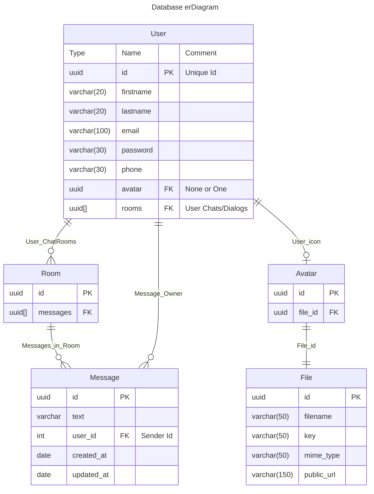

# academy-hw8

```mermaid

---
title: Database erDiagram
---
    erDiagram

    User {
        Type Name  "Comment"
        uuid id PK "Unique Id"
        varchar(20) firstname
        varchar(20) lastname
        varchar(100) email
        varchar(30) password
        varchar(30) phone
        uuid avatar FK "None or One"
        uuid[] rooms FK "User Chats/Dialogs"
    }

    Message {
        uuid id PK
        varchar text
        int user_id FK "Sender Id"
        date created_at
        date updated_at
    }

    Room {
        uuid id PK
        uuid[] messages FK
    }

    Room ||--o{ Message : Messages_in_Room
    User ||--o{ Room : User_ChatRooms
    User ||--o| Avatar : User_icon
    Avatar ||--|| File : File_id
    Message }o--|| User : Message_Owner

    Avatar {
        uuid id PK
        uuid file_id FK
    }

    File {
        uuid id PK
        varchar(50) filename
        varchar(50) key
        varchar(50) mime_type
        varchar(150) public_url
    }


```
