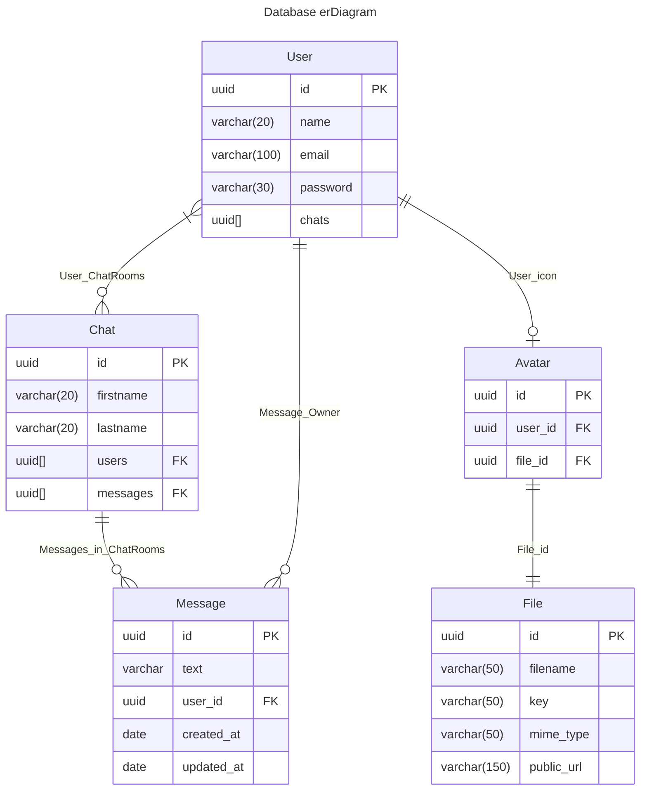

# entity relationship diagram for chat-messenger app

```mermaid

---
title: Database erDiagram
---
    erDiagram


    User {
        uuid id PK
        varchar(20) name
        varchar(100) email
        varchar(30) password
        uuid[] chats
    }

    Message {
        uuid id PK
        varchar text
        uuid user_id FK
        date created_at
        date updated_at
    }

    Chat {
        uuid id PK
        varchar(20) firstname
        varchar(20) lastname
        uuid[] users FK
        uuid[] messages FK
    }

    Chat ||--o{ Message : Messages_in_ChatRooms
    User }|--o{ Chat : User_ChatRooms
    User ||--o| Avatar : User_icon
    Avatar ||--|| File : File_id
    Message }o--|| User : Message_Owner

    Avatar {
        uuid id PK
        uuid user_id FK
        uuid file_id FK
    }

    File {
        uuid id PK
        varchar(50) filename
        varchar(50) key
        varchar(50) mime_type
        varchar(150) public_url
    }


```
